footer: Gutenberg | How a WordPress studio adapted - David Darke | [atomicsmash.co.uk](https://www.atomicsmash.co.uk)
slidenumbers: true

# [fit] Gutenberg
# [fit] How a WordPress studio adapted

## **By David Darke**

---

---

# [fit] How we started

---

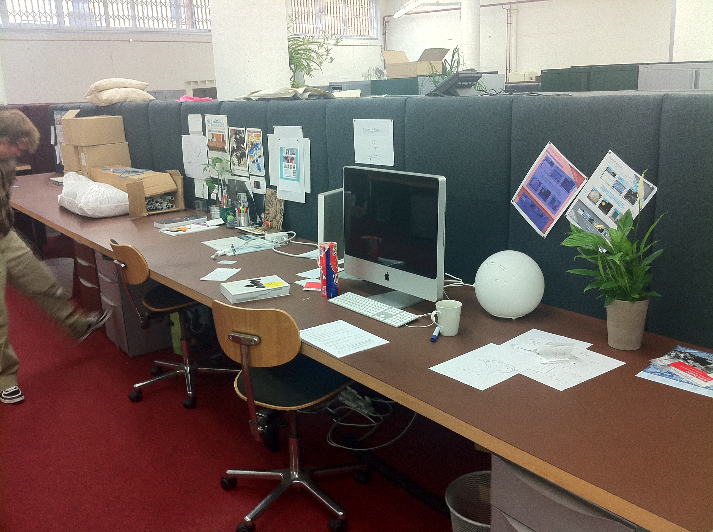

---

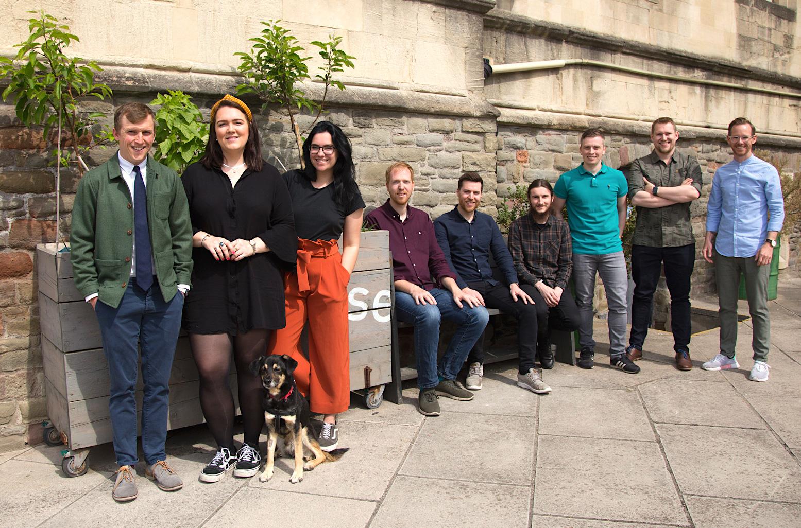

---

## When we began, we used...

---

# [fit] ... a custom CMS

 

# [fit] 🤮🤯😱💀😵🤢

---

# [fit] WordPress enters

---

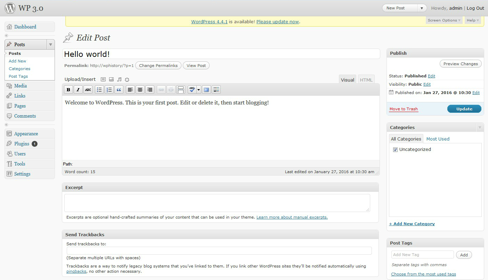

---

# [fit] WordPress delivered:

- Simple and reliable content delivery
- Clear page hierarchy / url structure
- Simple menu system
- Basic media library

---

# [fit] There was one thing missing...

---

# [fit] Custom fields!!!

---

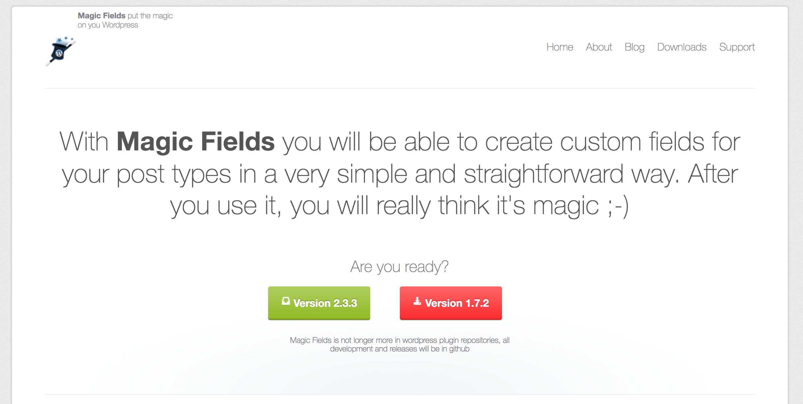

---

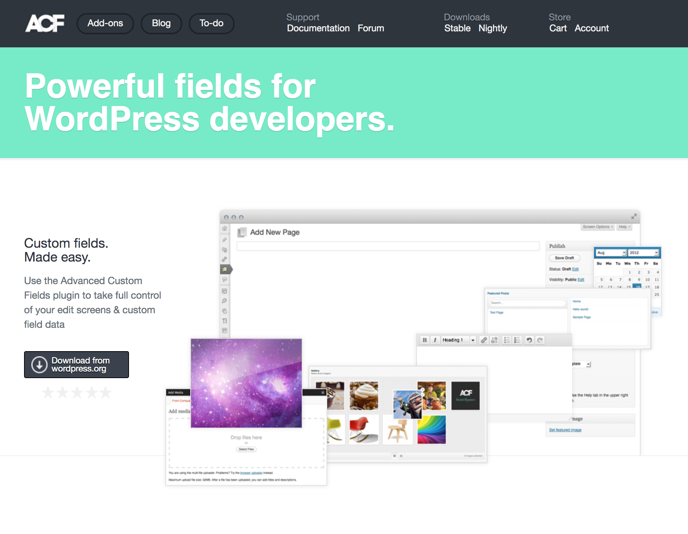

---

# [fit] ACF allowed us

- Easily create robust field sets
- Build post to post relationships
- Fashion basic event system / queries
- Build a block / page building system

---

# [fit] Next challenge
# [fit] Build a better content editor

---

---

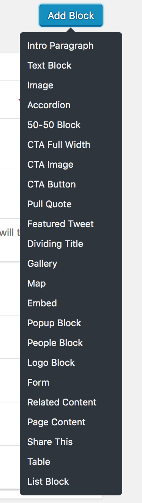

---

# This was great, but keeping field in sync between dev and production as **PAINFUL!**

---

# [fit] Then ACF Pro added JSON support

---

# [fit] Why is that feature so important?

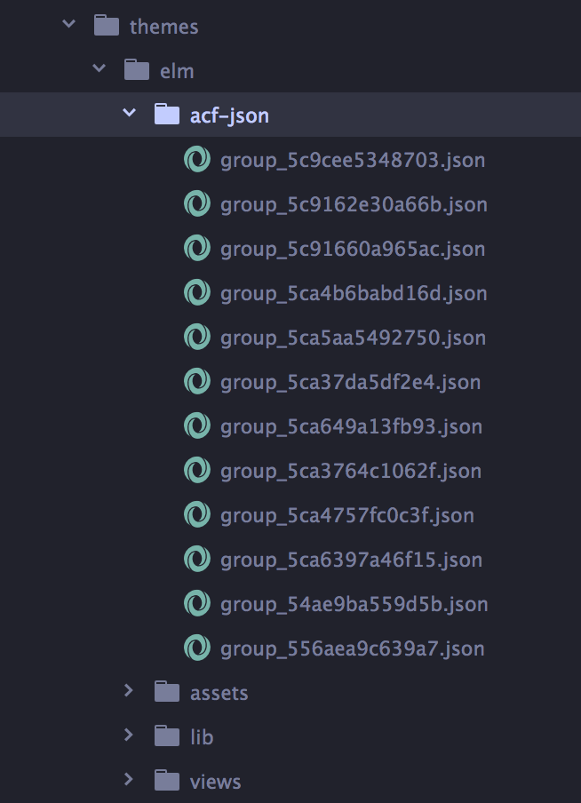

---

## This is the foundation our internal development framework

---

# Then...

# [fit] Gutenberg was announced

---

- Initial commit 3rd Feb 2017
- Months rolled past
- Beta versions and release candidates appeared

---

# The pitch

Gutenberg looks at the editor as more than a content field, revisiting a layout that has been largely unchanged for almost a decade.This allows us to holistically design a modern editing experience and build a foundation for things to come.

## [fit] 👍👍👍👍👍👍👍👍👍👍👍👍

---

# The reality...

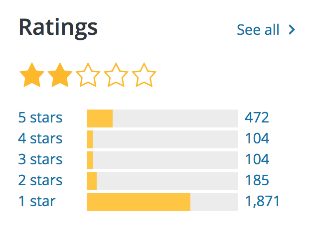

## [fit] 👎👎👎👎👎👎👎👎👎👎👎👎

---

# [fit] But why?

---

# Initial problems and some loss of confidence

- Releases were buggy
- A sense of this change being forced on a community
- No real clarity around the classic editor and what it was meant to do
- The negative voices outweighed positive

---

# [fit] Deeper reasons

---

# [fit] **Technical changes**

# Widely used frameworks would be affected

---

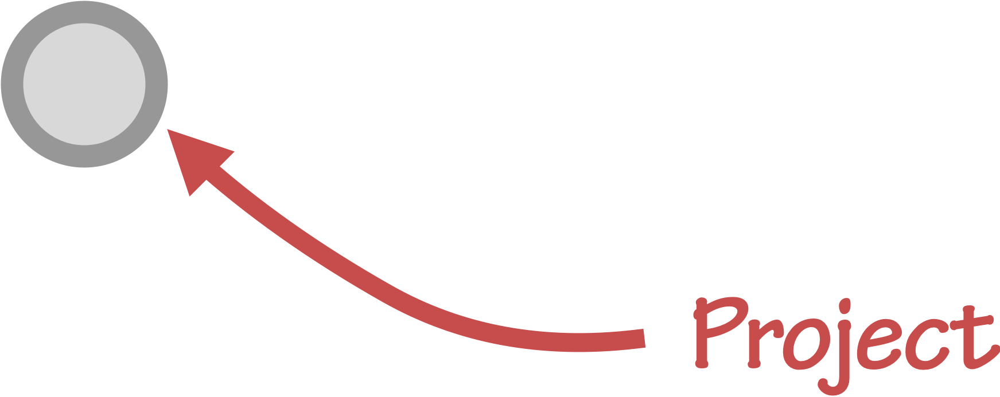

---

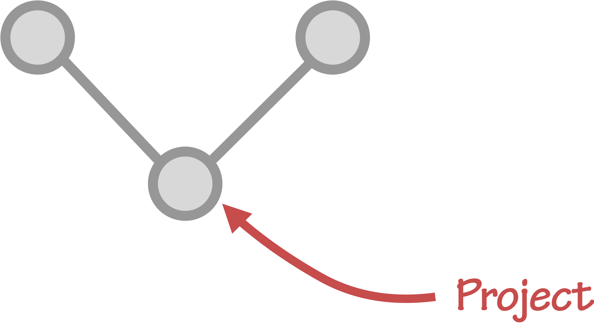

---

---

---

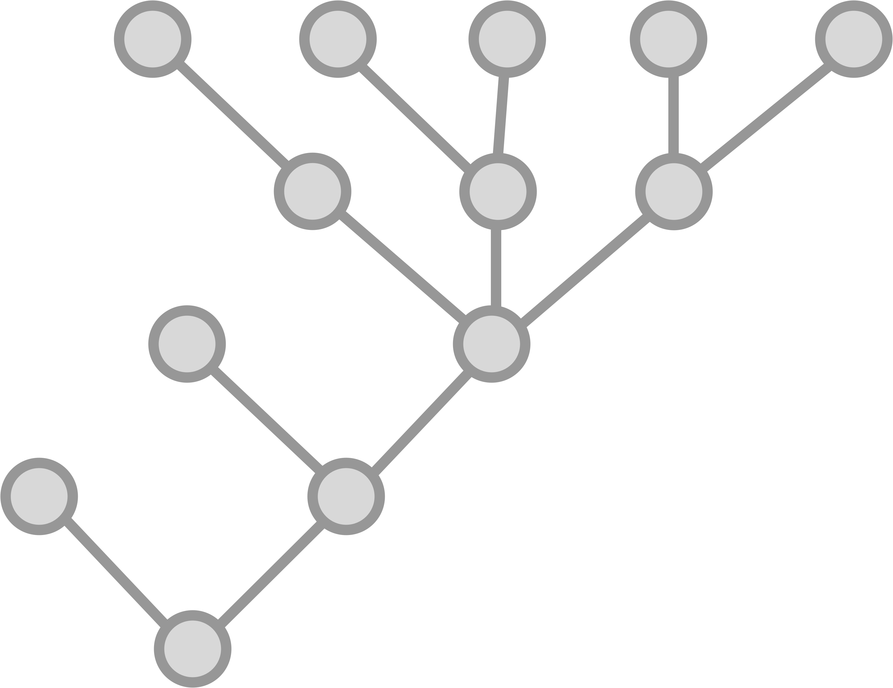

---

# [fit] Client relationships

- How to discuss this big change to their precious website?
 - Some clients will like the update, some won't.
- Will there be problems?
- How long will it take to sort?
- What is YOUR plan?

---

# [fit] What we did Atomic Smash

- Composer helped us... ALOT
 - It allowed us to fix the core version and pre load the classic editor
- Pre Xmas 2018 we updated a couple of sites
- Post Xmas 2018 we updated the rest

---

            - Go back to old project
            - Go back to blocks
            - Only new project have Gutenberg
             - Talk about new AS site
        	- data structure

---

---

# THANKS!

Follow me:
@david_darke

Follow the studio on:
@atomicsmash

---

 

# [fit] Any questions? 🤔
