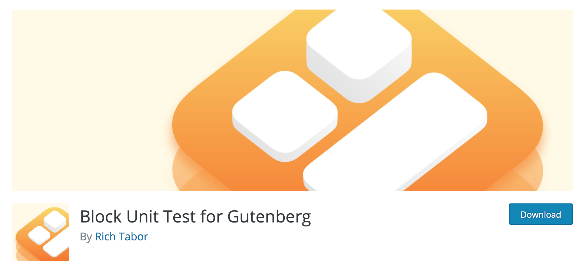

footer: Gutenberg | How a WordPress studio adapted - David Darke | [atomicsmash.co.uk](https://www.atomicsmash.co.uk)
slidenumbers: true

# [fit] Gutenberg
# [fit] How a WordPress studio adapted

## **By David Darke**

---


---

# [fit] How we started

---


---


---

## When we began, we used...

---

# [fit] ... a custom CMS

<br>

# [fit] 🤮🤯😱💀😵🤢

---

# [fit] How about... WordPress?

---


---

# [fit] WordPress delivered:

- Simple and reliable content delivery
- Clear page hierarchy / URL structure
- Simple menu system
- Basic media library

---

# [fit] There were limitations

---


---


---


---

# [fit] ACF allowed us

- Easily create robust fieldsets
- Build post to post relationships
- Fashion basic event system / queries
- Build a block / page building system

---

# [fit] Next challenge:
# [fit] Build a more flexible
# [fit] content editor

---


---


---

# This was great, but keeping fields in sync between development and production was **PAINFUL!**

---

# [fit] Then ACF Pro added JSON support


---

# [fit] Why is that feature so important?


---

## This was the foundation of our internal development framework

---

# Then...

# [fit] Gutenberg was announced


---

- Initial commit 3rd Feb 2017.
- Months rolled past.
- Beta versions and release candidates appeared.
- Sounded great, but we were worried about the impact on our day-to-day.

---

# The pitch

Gutenberg looks at the editor as more than a content field, revisiting a layout that has been largely unchanged for almost a decade. This allows us to holistically design a modern editing experience and build a foundation for things to come.

## [fit] ğŸ‘ğŸ‘ğŸ‘ğŸ‘ğŸ‘ğŸ‘ğŸ‘ğŸ‘ğŸ‘ğŸ‘ğŸ‘ğŸ‘

---

# The reception...


## [fit] ğŸ‘ğŸ‘ğŸ‘ğŸ‘ğŸ‘ğŸ‘ğŸ‘ğŸ‘ğŸ‘ğŸ‘ğŸ‘ğŸ‘

---

# [fit] But why?

---

# Initial problems and some loss of confidence

- Releases were buggy
- A sense of this change being forced on a community
- No real clarity around the classic editor plugin and even how reliable it would be
- The negative voices outweighed positive

---

# [fit] Deeper reasons

---

# [fit] **Technical changes**

# Widely used frameworks would be affected

---


---


---


---


---

# [fit] **Another reason, Client relationships**

- How to discuss this big change to their precious website?
 - Some clients will like the update, some won't.
- Will there be problems?
- How long will it take to sort?


# Clients want a solid plan.

---

# [fit] First steps for Atomic Smash

- Composer helped us... A LOT
 - It allowed us to fix the core version and pre-load the classic editor
- Pre Xmas 2018 we updated a couple of sites to 5.0 (with classic editor installed)
 - Released December 6th, 2018 (Atomic Smash holiday started on the 19th)

---

# [fit] Studio is closed for two weeks at Xmas...


<br>
<br>
<br>

# [fit] 😉 **atomicsmash.co.uk/jobs** 😉

---

# [fit] What we did at Atomic Smash

- Composer helped us... ALOT
- Pre Xmas 2018 we updated a couple of sites
- **Post Xmas 2018 we updated the rest**

---

# Next, future planning

### - Review on a case by case basis whether the client needs/wants the update
### - All **new** project will use Gutenberg

---

# Next, future planning

### - Review on a case by case basis whether the client needs/wants the update
### - All **new** project will use Gutenberg

## Our next new project... our own site! 😬

---

# Know what Gutenberg blocks can and can't do in its current state

---


---

# Coping with data structure changes

---


---


---

<br><br>
<br>
<br>

```html
<!-- wp:image {"id":8}-->
<figure />
<!-- /wp:image -->

```

---

Content in one place


---

# Prepping for a new testing process

---

# [fit] Block Unit Test for Gutenberg



https://wordpress.org/plugins/block-unit-test/

---

# ACF is helping again, in the form of ACF blocks


---

# In Summary

- We entirely believe Gutenberg is the future of WordPress
    - But for right now, that doesn't mean it's for everyone
- The ecosystem around it is growing
- Stay flexible

---

# THANKS!

Follow me:
@david_darke

Follow the studio:
@atomicsmash

---

<br>

# [fit] Any questions? 🤔
